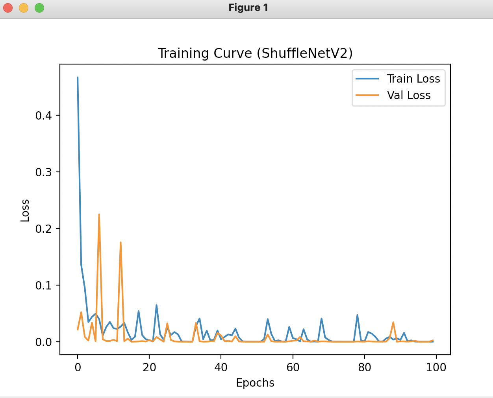

# 🎯 Real-Time Posture & Emotion Recognition using Dual-Headed ShuffleNetV2

A lightweight, real-time posture and emotion recognition system powered by **PyTorch** and **ShuffleNetV2**, designed for efficient CPU/GPU deployment. The model simultaneously classifies **posture** (e.g., `Upright`, `Hunched`) and **emotion** (e.g., `Relaxed`, `Angry`, `Stressed`) from webcam frames, making it ideal for real-time human monitoring applications.

---

## 📌 Project Highlights

- ✅ **Single-Pass Dual-Output Model**: Shared backbone with separate heads for posture and emotion.
- ✅ **Real-Time Inference**: Runs at 15–18 FPS on CPU.
- ✅ **Webcam Integration**: Seamless OpenCV-based live camera feed.
- ✅ **Logging**: Saves FPS, CPU/RAM usage, and predictions to a CSV file.
- ✅ **Modular Pipeline**: Easy to extend classes or integrate with edge devices.

---

## 📁 Project Structure

    .
    ├── README.md
    ├── dataset
    │   ├── hunched
    │   │   ├── angry
    │   │   ├── relaxed
    │   │   └── stressed
    │   └── upright
    │       ├── angry
    │       ├── relaxed
    │       └── stressed
    ├── frame-capturing.py
    ├── train.py
    ├── pipeline.py
    ├── main.py
    ├── logs
    │   └── realtime_log_shufflenet.csv
    │   └── realtime_log_shufflenet.csv
    ├── models
    │     └── shufflenet_class_info.pth
    │     └── shufflenet_dual_output_model.pt
    ├── assets

Scripts Overview

- train.py: Model training and validation using a dual-headed classifier.

- main.py: Real-time webcam inference and batch inference.

- pipeline.py: Core video frame classification logic.

- frame-capturing.py: Utility script to capture labeled frames.


## 💻 System Setup

- Python Version: 3.8.3
- Libraries Used:
All required libraries and dependencies are listed in [`requirements.txt`](requirements.txt).
- To ensure isolation and avoid dependency conflicts, it's recommended to use a Python virtual environment. Follow the steps below to set it up:
    1. Create a virtual environment:

        ```python3 -m venv my-env```
    2. Activate the virtual environment:

        ```source my-env/bin/activate```
    3. Install required packages:

        ```pip install -r requirements.txt```

    Once the environment is set up and dependencies are installed, you're ready to run the training and inference scripts.


## 🧠 Model Choice & Pipeline

🧩 Approach & Libraries Used

To address the dual-task problem of posture and emotion classification, a single model with dual outputs was developed using the PyTorch deep learning framework. The model is based on ShuffleNetV2, a lightweight and efficient CNN architecture, ideal for real-time applications and on-device deployment.

Key libraries used:

torch, torchvision – for model design, training, and inference.

OpenCV – for real-time webcam frame capture and display.

PIL, matplotlib, psutil, csv – for preprocessing, visualization, and performance logging.

The training script (train.py) handles data loading, augmentation, training, validation, and saving of the model and class mappings. The inference script (pipeline.py) is optimized for real-time webcam inference with overlay and logging support.

✅ Why ShuffleNetV2?

The ShuffleNetV2 architecture was chosen because of its balance between speed and accuracy, making it particularly suitable for real-time inference on CPU-only devices like standard laptops. Additional reasons include:

Efficiency: Extremely fast and low-latency model, ideal for real-time webcam input (~15+ FPS on CPU).

Compact Size: Small model size allows fast loading and minimal memory usage.

Familiarity: Well-supported in PyTorch with a flexible API for modifications.

Dual-Task Capability: Easy to extend with dual output heads for simultaneous classification of posture and emotion.

## ⏳ Training

Run the Training Script
Once the dataset is set up, execute the training script by running:

```python train.py```

The model will be trained for the specified number of epochs. During training, the script will log the training and validation losses to shufflenet_training_log.csv, and it will save the trained model and class mappings in shufflenet_dual_output_model.pt and shufflenet_class_info.pth, respectively.

📈 Training Performance



## 🔍 Inference Guide
Once your model is trained and saved, you can test it either in real-time using a webcam or on a batch of saved images.

🟢 1. Real-Time Webcam Inference
To launch the webcam-based posture and emotion detection pipeline:

```python main.py --mode infer```

🔹 This will:

Open your webcam.

Perform posture and emotion classification on each frame.

Display predictions as an overlay on the video feed.

Log CPU usage, memory usage, FPS, and prediction results in logs/realtime_log_shufflenet.csv.

📦 2. Batch Inference on a Dataset
To evaluate the trained model on a folder of images (without webcam):

```python main.py --mode batch --dataset mini_dataset```

## 🚀 Future Improvements [Accuracy]

Potential ways to raise accuracy

- Collect more diverse data with better class balance, varied lighting, and multiple subjects to improve generalization.

- Apply advanced augmentation techniques like rotation, occlusion, brightness shifts, and synthetic data generation.

- Incorporate pre-trained emotion models (e.g., FER+, AffectNet) as a feature extractor or for transfer learning.

- Train longer with learning rate scheduling and apply early stopping based on validation accuracy to avoid underfitting.

Potential ways to reduce compute usage

- Apply ONNX conversion with runtime optimizations for CPU deployment.

- Use smaller input resolutions (e.g., 96x96) without losing too much accuracy.

- Minimize real-time overlay complexity and frame processing (e.g., skip frames or use threading).

- Use PyTorch’s dynamic quantization for fully connected layers (ideal for inference):

    ```torch.quantization.quantize_dynamic(model, {nn.Linear}, dtype=torch.qint8)```

    For more aggressive size and latency reduction, apply post-training static quantization:

    Fuse Conv + BN + ReLU layers.

    Prepare the model with calibration data.

    Convert it using PyTorch’s static quantization API.
